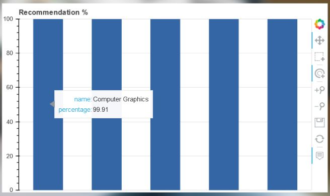
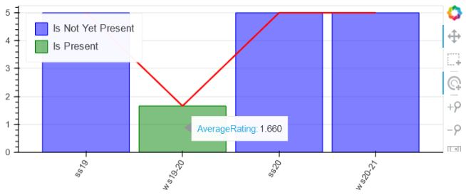

# Table of content 
- [Courses](#headers)
- [Dataset Description](#headers1)
- [Implementation Technologies](#headers2)
- [App Structure](#headers3)
- [Visualization](#headers4)
- [To deploy the project](#headers5)
- [Members](#headers6)

<a name="headers"/>


<br>
<br>
<a href="https://www.youtube.com/watch?v=3nJdvB94k4U&ab_channel=Philipp">A Youtube video shows a demo</a>


# Courses
Welcome to the Lecture Recommender Application: <b>Courses</b>.<br>
In this project work we use informations about the study programm and interests of students to recommend them the courses that fit the best to them.
We give the students the possibility to dive deeper into the lecture information as well as lectures evaluations from the previous semesters.
* The Lecture Recommender Application was created as part of a school project for [Learning Analytics](https://www.uni-due.de/soco/teaching/courses/lecture-la-ws18.php)


See the deployed application on Heroku server:

* [Courses](https://laproject.herokuapp.com/)

<a name="headers1"/>

# Dataset Description
For this project we created our own dataset based on infromations collected from the [Module Database](https://www.uni-due.de/vdb/en_EN/pruefung/1245/detail) for the lectures of the [Department of Computer Science and Applied Cognitive Science (INKO)](https://www.uni-due.de/iw/inko/en/).
These informations are:
* Lecture name
* Language
* Assigned Study Courses
* Assigned People
* Lecture Description, Learning Targets and Pre-Qualifications

Beside these informations, we also collected informations from the [Course Evaluation](https://moodle.uni-due.de/course/view.php?id=2032) which is a summary of students evaluations of lectures for the <b>sommer semester 2019</b> and the <b>winter semester 2019/2020</b>. For privacy reasons the course evaluation is only accessible for students with a moodle account and contains only the evaluation of students for the last 2 years.
These informations are:
* Average rating of the lecture
* Positiv and negative comments of students about the lectures

Needed libraries:

```ruby
* Beautifulsoup
* PyPDF2
```

<a name="headers2"/>

# Implementation Technologies
This project is based on the following technologies:

* Front-End
  + Website
    + Flask templates
    + CSS
    + HTML
  + Visualisation
    + Bokeh
* Back-End
  + Web Server
    + Python
    + Flask
  +  Data Scraping
     +  Beautifulsoup
     +  PyPDF2
  +  Natural Language Processing (NLP)
     + NLTK  
  + Machine Learning 
    + Gensim
  + Database
    + mongoDB

<a name="headers3"/>

# App Structure
The project has the following structure:

App (Couses):
  + data(folder)
    + bokeh(folder)
      + recommendation_graph.py       (create visualization graphs)
    + docs(folder)   (:warning: Some informations about the lecture will be remove due to privacy issues)
      + html_page_comments(folder)    (comments pages in html format used for scraping)
      + html_page_gesamtbewertung(folder) (pages containing the average rating of lectures in html format used for scraping)
      + pdf_page_comments(folder)     (comments pages in pdf)
      + pdf_page_gesamtbewertung(folder)  (pages containing the average rating of lectures in pdf format)
      + ss2019(folder)  (pdfs containing the evaluation of lectures during the summer semester 2019)
      + ws_19_20(folder) (pdfs containing the evaluation of lectures during the winter semester 2018-2019)
      + readMe.md                     (list of lectures ([INKO](https://www.uni-due.de/iw/inko/en/) department))
    + machine_learning(folder)
      + recommandation
            + content_based
               + gensim_d2v.py (machine learning model)
    + nlp(folder)
      + cleaner.py          (clean the data from the database)           
    + db.py                 (connect to the database)
    + scrape.py             (scrape the data and save them in the database)
  + static (folder)
    + css (folder)
    + images (folder)
    + js (folder)
  + templates (folder)
    + about_us.html         (about us page)
	   + app.html              (app page shown after login)
	   + course.html           (course page)
	   + index.html            (home page)
    + signin.html  (sign in page)

## Machine Learning Pipeline
* <a href="data/nlp/cleaner.py">Data preprocessing</a>
  + Remove html Tags, punctuations, stop words from the <i>description</i>, <i>learning_targets</i> and <i>pre_qualifications</i> columns, 
  + Lemmatization
  + Merging the 3 columns to form a main column
* <a href="data/machine_learning/recommandation/content_based/gensim_d2v.py">Machine Learning Algorithm</a> 
  + Word tokenization
  + Data Filtering based on Input of the user (language, study course)
  + Document Tagging
  + Model Building (Doc2Vec)

Needed libraries:

```ruby
* gensim
* nltk
* pandas
```

## Web structure preparation (app.py)
app.py is the main file for our backend server using "Flask" python framework. The server starts by rendering the <a href="templates/index.html"> Home Page </a> on http://localhost:5000/.

```ruby
@app.route('/')
def home():
    return render_template('index.html')
```

<a name="headers4"/>

# Visualization
All Visualisation chart is built using:

+ <a href="https://bokeh.org/"> Bokeh </a>

 <b>Example 1</b>: 
 createRecommendationGraph function: creates Bar chart for recommendations.

```ruby
    def createRecommendationGraph(self, recommendations):
        courses = []
        percentage = []
        if recommendations:
            for x in recommendations:
                if x[0] not in courses:
                    p = x[1] * 100
                    courses.append(x[0])
                    percentage.append(p)

            source = ColumnDataSource(data=dict(courses=courses, percentage=percentage))

            TOOLTIPS = [("name","@courses"), ("percentage", "@percentage{0.2f}")]

            # sorting the bars means sorting the range factors
            sorted_courses = sorted(courses, key=lambda x: percentage[courses.index(x)])

            p = figure(x_range=sorted_courses, plot_height=350, y_range=(0,100), title="Recommendation %", tools="hover,pan,box_select,zoom_in,zoom_out,save,reset,tap", tooltips=TOOLTIPS) 

            p.vbar(x='courses', top='percentage', width=0.5, source=source, color="rgb(52,101,164)")

            url = "https://laproject.herokuapp.com/course/@courses"
            # url = "http://127.0.0.1:5000/course/@courses"
            

            taptool = p.select(type=TapTool)
            taptool.callback = OpenURL(url=url)

            p.xaxis.visible = None
            p.xgrid.grid_line_color = None
            p.y_range.start = 0

            script,div = components(p)
            cdn_js = CDN.js_files[0]
            cdn_css = CDN.css_files
            return script, div, cdn_css, cdn_js
        else:
            print("No recommendations found")
            return "No recommendations found"
```


<b>Example 2</b>: 
 createAverageRatingGraph function: creates Bar chart for average rating distribution over the last 4 semesters. 

```ruby
    def createAverageRatingGraph(self, rating, semester):

        semesters = ['ss19', 'ws19-20', 'ss20', 'ws20-21']
        #avg. of course rating
        avg = []
        status = ["Is Present", "Is Not Yet Present","Is Not Yet Present","Is Not Yet Present"]
        status1 = ["Is Not Yet Present","Is Present","Is Not Yet Present","Is Not Yet Present"]
        status2 = ["Is Not Yet Present", "Is Not Yet Present","Is Not Yet Present","Is Not Yet Present"]

        rating = rating.replace(",",".")
        if semester == 'ss19':
            avg = [float(rating),5,5,5]
            source = ColumnDataSource(data=dict(semester=semesters, avg=avg, status=status, color=["green","blue","blue","blue"]))
        elif semester == 'ws19-20':
            avg = [5,float(rating), 5, 5]
            source = ColumnDataSource(data=dict(semester=semesters, avg=avg, status=status1, color=["blue","green","blue","blue"]))
        else:
            avg = [5,5,5,5]
            source = ColumnDataSource(data=dict(semester=semesters, avg=avg, status=status2, color=["blue","blue","blue","blue"]))
        
        # source = ColumnDataSource(data=dict(semester=semesters, avg=avg, color=["green","blue","blue","blue"]))

        print(semesters)
        print(avg)
        TOOLTIPS = [("AverageRating", "@avg")]

        p2 = figure(x_range=semesters, plot_height=250, tools="hover,pan,box_select,zoom_in,zoom_out,save,reset,tap", tooltips=TOOLTIPS)

        p2.vbar(x='semester', top='avg', width=0.9, fill_alpha=0.5, color='color',source=source, legend='status')

        p2.line(x=semesters, y=avg, color="red", line_width=2)

        # url = "https://trello.com/c/YcD1oQfR/36-bokeh-visualization-of-the-recommendation"
        # taptool = p2.select(type=TapTool)
        # taptool.callback = OpenURL(url=url)
        
        p2.y_range.start = 0
        p2.x_range.range_padding = 0.1
        p2.xaxis.major_label_orientation = 1
        p2.xgrid.grid_line_color = None
        p2.legend.location = "top_left"
        script2,div2 = components(p2)
        cdn_js2 = CDN.js_files[0]
        cdn_css2 = CDN.css_files
        return script2, div2, cdn_css2, cdn_js2
```


<a name="headers5"/>

# To deploy the project
First you need to install below requirements:
+ <a href="https://code.visualstudio.com/download">Download Visual Studio Code</a> or your preferred IDE.
+ <a href="https://www.python.org/downloads/">Download latest version of Python</a>

After configuring the python inside your IDE you need to install this project from this repository. 

Then you need to install below requirements on our system:
  * [Flask](https://flask.palletsprojects.com/en/1.1.x/installation/#install-flask) == 1.1.1
  * [Pandas](https://pypi.org/project/pandas/) == 0.25.2
  * [Bokeh](https://docs.bokeh.org/en/latest/docs/first_steps/installation.html) == 2.3.0
  * [PyMongo](https://pymongo.readthedocs.io/en/stable/installation.html) == 3.11.3
  * [Gensim](https://pypi.org/project/gensim/) == 3.8.3
  * [BeautifulSoup](https://www.crummy.com/software/BeautifulSoup/bs4/doc/#installing-beautiful-soup) == 4.9.0
  * [PyPDF2](https://pypi.org/project/PyPDF2/) == 1.26.0
  * [NLTK](https://www.nltk.org/install.html) == 3.5
  * [dotenv](https://pypi.org/project/python-dotenv/) == 0.15.0

## Usage

### Scraping
```bash
 python data/scrape.py
```
### Run Application
```bash
python app.py
```

## Some Resources (Documentation and other links)
#### Scraping
* [PDF Processing with Python](https://towardsdatascience.com/pdf-preprocessing-with-python-19829752af9f)
#### NLP
* [Text Cleaning in Natural Language Processing(NLP)](https://medium.com/analytics-vidhya/text-cleaning-in-natural-language-processing-nlp-bea2c27035a6)
* [NLP for Beginners: Cleaning & Preprocessing Text Data](https://towardsdatascience.com/nlp-for-beginners-cleaning-preprocessing-text-data-ae8e306bef0f)
* [Text Cleaning Methods for Natural Language Processing](https://towardsdatascience.com/text-cleaning-methods-for-natural-language-processing-f2fc1796e8c7)
#### Machine Learning
* [Tf-Idf vs Doc2Vec - Contrast and Compare](https://www.youtube.com/watch?v=iSkbq6Tjkj0&ab_channel=AliannaJ.Maren)
<a name="headers6"/>

# Members
* Martin [Github](https://github.com/martingarcia99) [LinkedIn](https://www.linkedin.com/in/mart%C3%ADn-jos%C3%A9-garc%C3%ADa-mu%C3%B1oz-328757193/)
* Philipp [Github](https://github.com/LA-UDE) [Xing](https://www.xing.com/profile/Philipp_Herrmann84)
* Veronika [Github](https://github.com/verodemy)
* Paul [Github](https://github.com/Arthuro1) [LinkedIn](https://www.linkedin.com/in/paul-arthur-meteng-kamdem-06b922125/)

